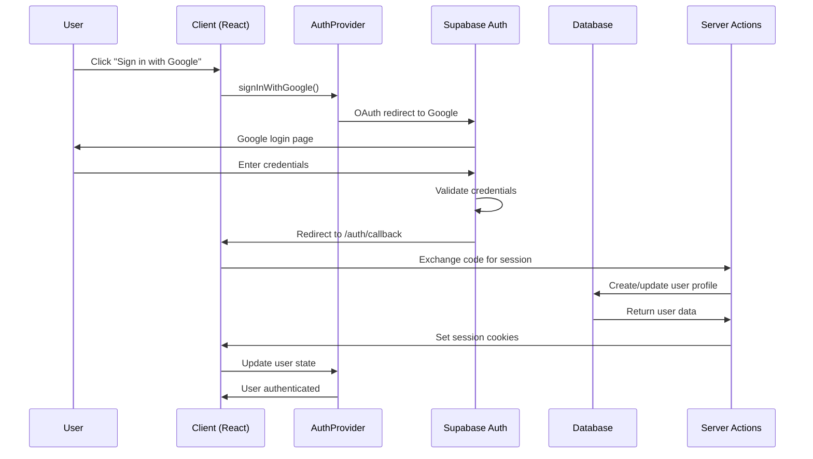
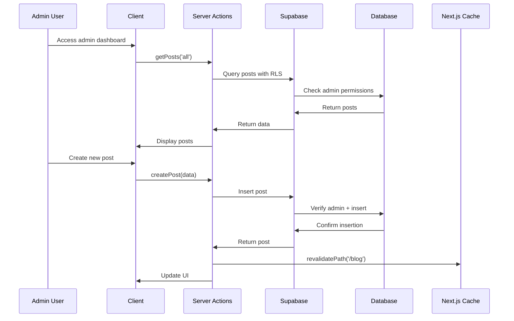
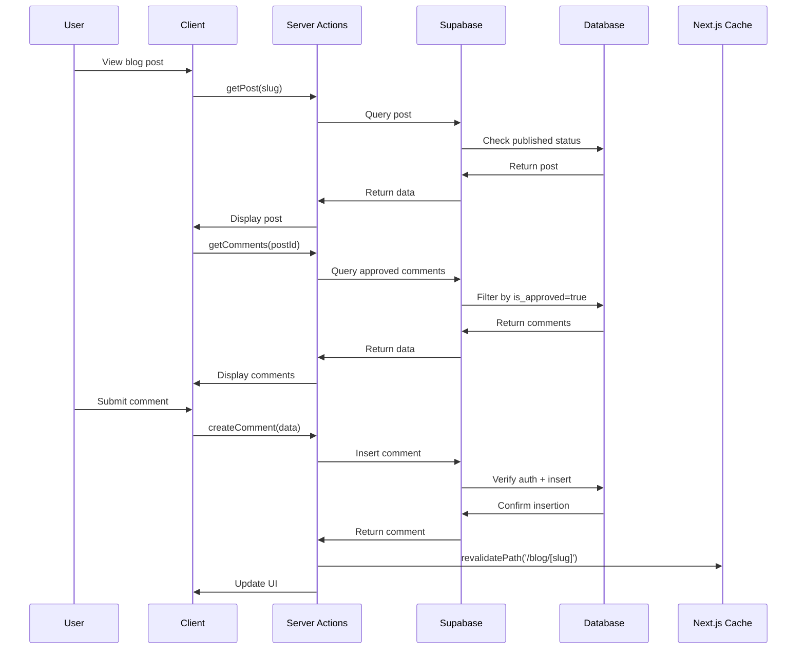
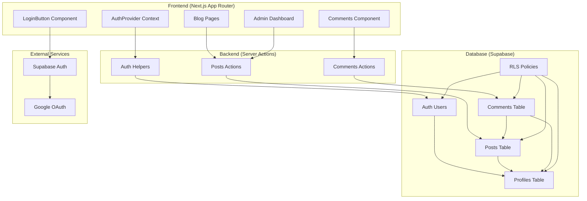
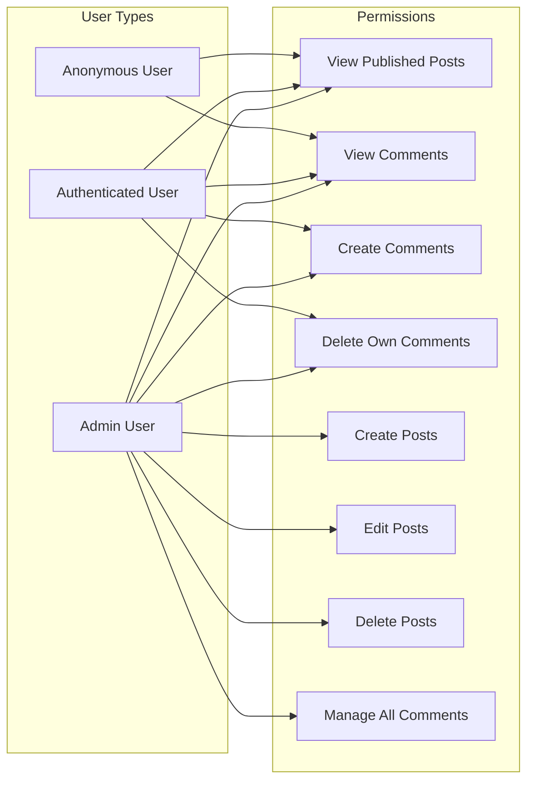
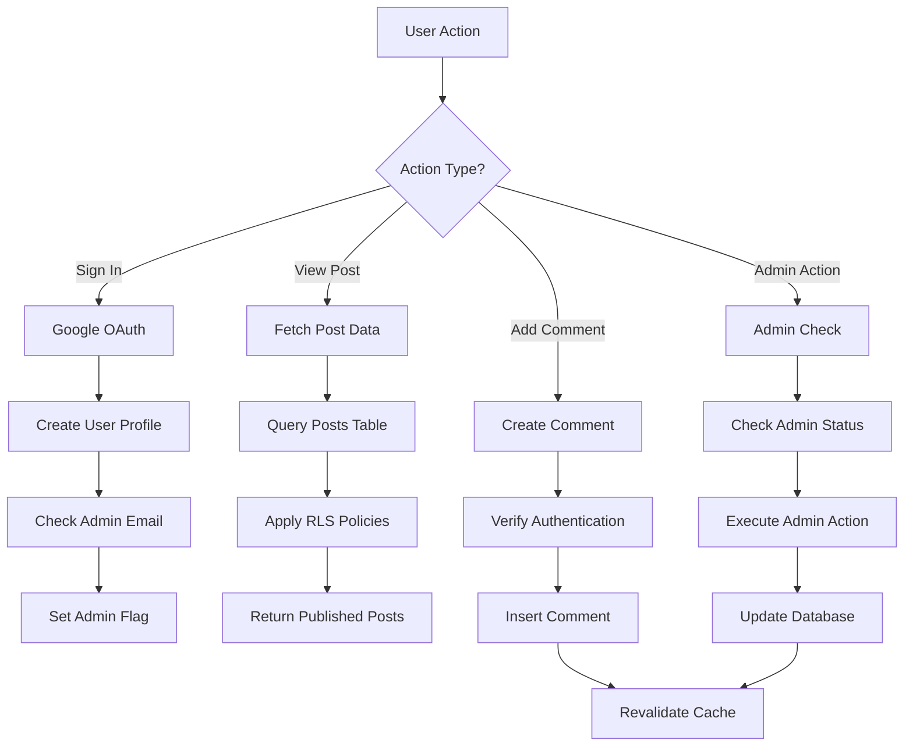
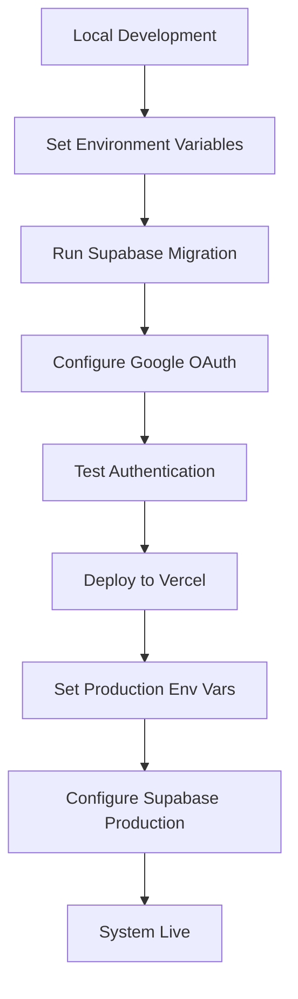
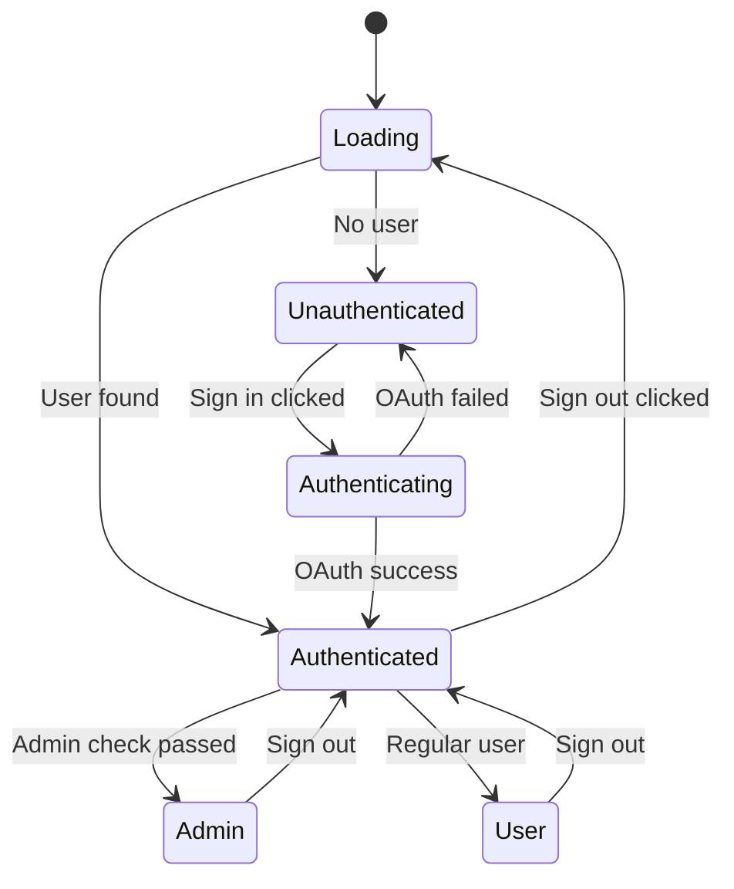

# AI Blog System - Complete Architecture Flow

## 🔐 Authentication Flow



## 📝 Blog Post Management Flow



## 💬 Comment System Flow



## 🏗️ System Architecture



## 🔒 Security & Permissions Matrix



## 📊 Data Flow Diagram



## 🚀 Deployment Flow



## 📁 File Structure

```
all_ai/
├── src/
│   ├── app/
│   │   ├── auth/
│   │   │   └── callback/
│   │   │       └── route.ts          # OAuth callback handler
│   │   ├── blog/
│   │   │   ├── [slug]/
│   │   │   │   └── page.tsx          # Individual blog post
│   │   │   └── page.tsx              # Blog listing
│   │   └── layout.tsx                # Root layout with AuthProvider
│   ├── components/
│   │   ├── AuthProvider.tsx          # Auth context provider
│   │   ├── LoginButton.tsx           # Sign in/out button
│   │   ├── Comments.tsx              # Comment system
│   │   └── ui/
│   │       └── button.tsx            # Reusable button component
│   └── lib/
│       ├── supabase.ts               # Supabase client config
│       ├── auth-helpers.ts           # Server auth utilities
│       ├── posts.ts                  # Post CRUD actions
│       └── comments.ts               # Comment actions
├── supabase/
│   └── migrations/
│       └── 001_initial_schema.sql   # Database schema
└── .env.local                        # Environment variables
```

## 🔄 State Management Flow



## 🎯 Key Features Summary

### ✅ **Implemented**

- **Google OAuth Authentication** with Supabase
- **Admin Role Management** via email allowlist
- **Row Level Security** policies for data protection
- **Server Actions** for secure data operations
- **Real-time Auth State** with React context
- **Comment System** with user permissions
- **Automatic Cache Revalidation** after changes
- **Responsive UI Components** with proper error handling

### 🔄 **Data Flow**

1. **Auth**: User signs in → Profile created → Admin status checked
2. **Posts**: Admin creates → RLS validates → Cache updated
3. **Comments**: User comments → Auth verified → Real-time update
4. **Security**: Every request → RLS policies → Permission checked

### 🛡️ **Security Features**

- **RLS Policies**: Database-level security
- **Server Actions**: Server-side validation
- **Admin Allowlist**: Email-based admin control
- **Session Management**: Secure cookie handling
- **Input Validation**: Server-side sanitization

This architecture provides a secure, scalable, and user-friendly blog system with proper separation of concerns and modern React/Next.js patterns.
